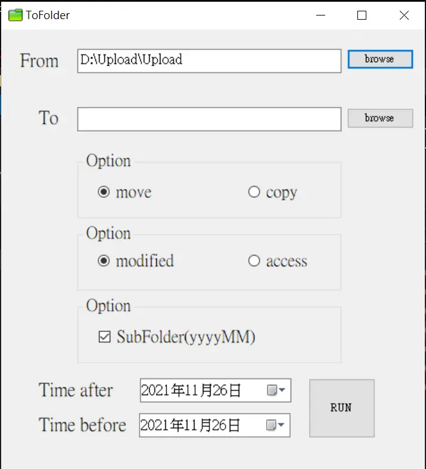
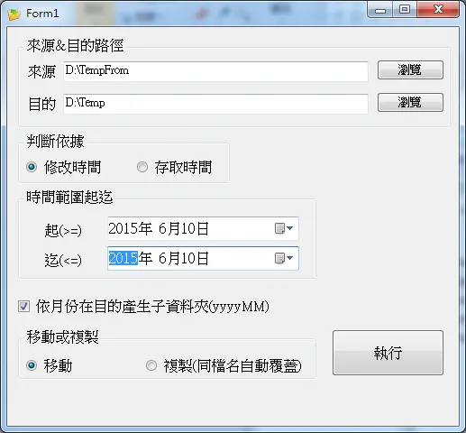

為了移 FileServer 的檔案開發的  
系統當時沒寫好 上傳的東西都塞同個資料夾  
FileServer 空間滿了要移檔案  
Windows 檔案總管一開因檔案太多還得等個幾十分鐘才有畫面  
選檔案也是個麻煩事  
乾脆寫個檔案處理這些麻煩事

It was created by moving files from fileserver.  
The system puts all files to one folder.  
When the folder is full,I need to move older files to other HDD.  
To open this folder by windows explorer,  
it is very slow because there are too many files.  
It is also difficult to select older files by sorting.  
So this application was created.

 

 

 

